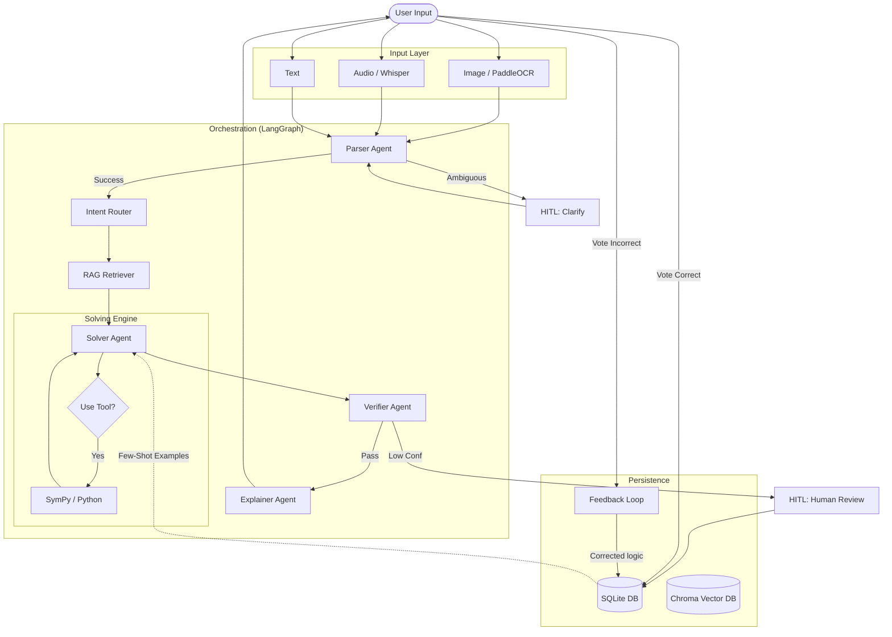

# 🎓 Multimodal Math Mentor

An advanced, reliable AI-powered Math Mentor application capable of solving JEE-style math problems from text, images, and audio. Built with **Agentic Workflows (LangGraph)**, **RAG**, **Human-in-the-Loop (HITL)**, and **Self-Learning Memory**.


## 🚀 Key Features

*   **Multimodal Input**: Accepts **Text** (typed), **Images** (OCR via PaddleOCR), and **Audio** (Speech-to-Text via Whisper).
*   **Reliable Math Solving**: Uses a **SymPy-powered Solver Agent** that delegates calculations to Python code, preventing LLM arithmetic hallucinations.
*   **Multi-Agent Architecture**: Orchestrated by **LangGraph**, featuring specialized agents for Parsing, Routing, Solving, Verification, and Explanation.
*   **RAG (Retrieval-Augmented Generation)**: Retrieves relevant math formulas, identities, and common pitfalls from a curated ChromaDB knowledge base.
*   **Self-Learning Memory**: Remembers correctly solved problems. If feedback is negative + corrected, it learns the new solution pattern for future use.
*   **Human-in-the-Loop**: Safely pauses for user clarification if inputs are ambiguous or OCR/ASR confidence is low.

---

## 🛠️ Tech Stack & Models

### Core Frameworks
*   **Orchestration**: `LangGraph` (for stateful multi-agent workflows).
*   **LLM Interface**: `LangChain` + `Ollama`.
*   **UI**: `Streamlit`.
*   **Database**: `SQLite` (Structured Metadata) + `ChromaDB` (Vector Store).

### Models & Tools
*   **LLM**: `qwen2.5:1.5b` (**Local Ollama**). chosen for speed and efficiency on local hardware.
*   **OCR (Image-to-Text)**: `PaddleOCR` (Local CPU mode).
*   **ASR (Audio-to-Text)**: `OpenAI Whisper` (Base model, Local).
*   **Embeddings**: `sentence-transformers/all-MiniLM-L6-v2`.
*   **Math Engine**: `SymPy` (Symbolic Python) & `NumPy`.

---

## 🤖 Agent System Architecture

The system uses a directed graph (Graph Architecture) where problems pass through specialized nodes:

1.  **Guardrail Agent**: Checks input for safety and relevance ("Is this a math problem?").
2.  **Parser Agent**: Extracts structured data (Variables, Constraints) from raw text. *Triggers HITL if ambiguous.*
    *   *Feature*: Uses "Data Extraction" prompting to prevent hallucination.
3.  **Intent Router**: Classifies the math topic (Algebra, Calculus, etc.) and strategy.
4.  **RAG Retriever**: Fetches relevant markdown docs (formulas/concepts) from `src/rag/documents`.
5.  **Solver Agent**: The core brain.
    *   *Tool Use*: Identifies if `SymPy` or `Python Calculator` is needed.
    *   *Execution*: extracting clean equations and running rigorous python code to get the answer.
6.  **Verifier Agent**: independent critic. Checks domain constraints and edge cases.
    *   *Confidence*: If verification < 75%, flags for human review.
7.  **Explainer Agent**: Converts the technical steps into a student-friendly guide with "Key Insights".

### 📊 System Architecture Diagram



---

## 🧠 Memory & Self-Learning Logic

The application implements a unique **Feedback Loop**:

1.  **Store**: Every successful interaction is saved in `SQLite`.
2.  **Feedback**: Users can vote 👍 (Correct) or 👎 (Incorrect).
3.  **One-Shot Learning**:
    *   If you mark a solution **Incorrect** AND provide a **Corrected Solution** in the comment box, the system captures this.
    *   On future queries of similar problems, the system prioritizes this *corrected* logic over its generated one, effectively "learning" from your teaching.

---

## 💻 Installation & Setup

### Prerequisites
*   **Python 3.10+**
*   **Ollama** installed and running locally.
*   **Microsoft C++ Build Tools** (Required for some Windows dependencies).

### 1. Model Setup (Ollama)
Install Ollama and pull the required small model:
```bash
ollama serve  # Start the server (keep running in separate terminal)
ollama pull qwen2.5:1.5b
```

### 2. Clone Repository
```bash
git clone https://github.com/Hartz-byte/multimodal-math-mentor.git
cd multimodal-math-mentor
```

### 3. Environment Setup
Create a virtual environment:
```bash
py -3.10 -m venv venv
# Windows
.\venv\Scripts\activate
# Linux/Mac
source venv/bin/activate
```

### 4. Install Dependencies
**Critial Step**: PyTorch (CPU) must be installed explicitly first to avoid conflicts on Windows.

```bash
# 1. Install CPU-only PyTorch first
pip install torch torchvision torchaudio --index-url https://download.pytorch.org/whl/cpu

# 2. Install remaining project requirements
pip install -r requirements.txt
```

### 5. Configuration
Create a `.env` file in the root directory:
```bash
# .env
OLLAMA_BASE_URL=http://localhost:11434
OLLAMA_MODEL=qwen2.5:1.5b
MEMORY_DB_PATH=data/memory.db
CHROMA_DB_PATH=data/chroma_db
```

---

## ▶️ Running the Application

1.  Ensure Ollama is running (`ollama serve`).
2.  Run the Streamlit app:
```bash
streamlit run app.py
```
3.  Open your browser at `http://localhost:8501`.

---

## 📂 Project Structure

```
multimodal-math-mentor/
├── app.py                  # Main Streamlit UI
├── requirements.txt        # Dependencies
├── src/
│   ├── agents/             # Agent definitions (Parser, Solver, etc.)
│   ├── input_processing/   # Multimedia handlers (PaddleOCR, Whisper)
│   ├── memory/             # Storage logic (SQLite, Feedback loop)
│   ├── orchestration/      # LangGraph workflow definitions
│   └── rag/                # Knowledge Base & Embeddings
│       └── documents/      # Markdown files for RAG
└── data/                   # Persistent storage (created at runtime)
```

---

## 📝 Usage Tips
*   **Input**: For "Image" mode, ensure the math text is clear and well-lit.
*   **Audio**: Speak clearly. The system auto-converts "times", "squared", "plus" to symbols.
*   **Tools**: The system decides when to use SymPy. For simple arithmetic like "2+2", it might just answer. For "Solve x^2...", it invokes the tool.

---

## ⚠️ Troubleshooting
*   **Ollama Error**: Ensure `ollama serve` is running.
*   **DLL / Torch Error**: Run the specific `pip install torch ... --index-url .../cpu` command again.
*   **Memory Issues**: The app uses `qwen2.5:1.5b` (approx 1.5GB VRAM/RAM). If crashing, ensure you have at least 8GB System RAM.

---

## 🛑 Challenges & Deployment Constraints

During the development of this application, several constraints influenced the architectural choices:

### 1. The Challenge of "Free Tier" Deployment
This application is designed as a **Production-Grade Local AI System**, using strictly open-source, locally hosted models for privacy and cost-efficiency.
*   **Model Size**: The combination of `Qwen2.5:1.5b` (LLM), `PaddleOCR` (Vision), `Whisper` (Audio), and `ChromaDB` (Embeddings) requires approximately **4GB - 6GB of RAM** to run smoothly.
*   **Cloud Constraints**: Standard free-tier platforms (Streamlit Community Cloud, Vercel, Render Free) typically limit RAM to **1GB or 512MB**, which causes immediate OOM (Out of Memory) crashes when loading these models.

### 2. Dependency Conflicts (Windows vs Linux)
*   **PyTorch**: We faced significant issues with PyTorch pulling CUDA (GPU) versions by default on Windows, leading to `WinError 127` (Missing DLLs) and massive binary sizes (>3GB).
*   **Solution**: We explicitly enforce **CPU-only PyTorch** in the setup instructions to ensure stability and reasonable package size.

> **Deployment Note**: Because of these hardware requirements, this project is demonstrated as a **Locally Hosted Application**. To deploy this to the cloud, one would need a persistent VPS with at least 8GB RAM (e.g., AWS EC2 t3.large or Railway Pro) or switch the Local LLM to a paid API (e.g., OpenAI/Groq).
